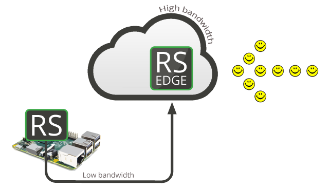
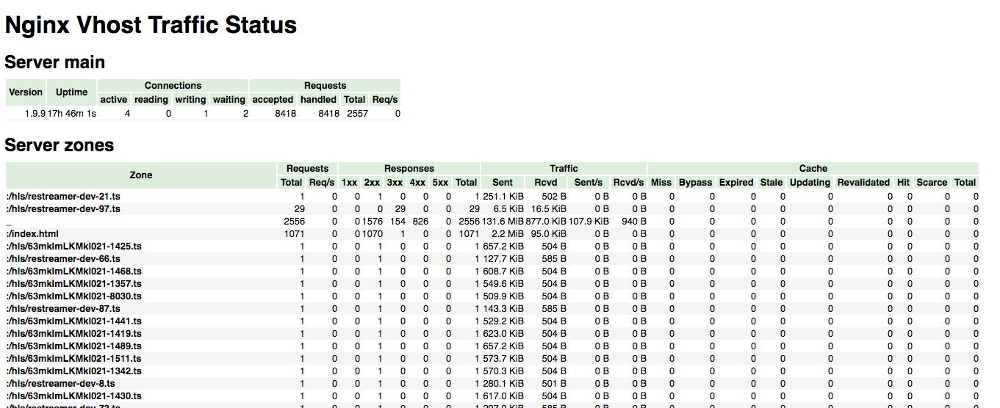

# Restreamer-Edge

This is an stable working concept to create a streaming service in front of the Datarhei/Restreamer.



Currently the Restreamer-Edge is very plain and bash based application without user-interface and administration. It's an experiment to learn more about this setup of applications. Do not no worry about "concept" and "very plain". It is tested over weeks and ready to run on your server or an cloud-space! It works stable like charm :-)

* [Docker startup](#docker-startup)
* [Enviroment playground](#enviroment-playground)
* [Enviroment variables](#enviroment-variables)
* [Hosting examples](#hosting-examples)
* [Optimizations / Tips](#optimizations--tips)
* [Help, bugs and future requests](#help-bugs-and-future-requests)

## Features

* [NGINX](http://nginx.org/) open source web server for high traffic
* [NGINX-RTMP-Module](https://github.com/arut/nginx-rtmp-module) as streaming-backend and HLS server
* [NGINX virtual host traffic status module](https://github.com/vozlt/nginx-module-vts) for http/hls-stats
* [NJS](https://github.com/nginx/njs) for the rtmp-authentification
* [Clappr-Player](https://github.com/clappr/clappr) as HLS-player to embed your stream upon your website (no Adobe Flash)
* [FFmpeg](http://ffmpeg.org) to create snapshots and live-transcode (if enabled) each is pushing streams to 240p, 360p, 480p and 720p
* [Let's Encrypt](https://github.com/letsencrypt/letsencrypt) to secure NGINX by a verified certificate

## Docker startup

#### Default:

```sh
docker run -d --name restreamer-edge --restart always -p 80:80 -p 1935:1935 \
  -e "HTTP_SERVER_HLS_STATUS_USERNAME=your-username" \
  -e "HTTP_SERVER_HLS_STATUS_PASSWORD=your-password" \
  -e "RTMP_SERVER_HLS_PUBLISH_TOKEN=your-secure-token" \
      datarhei/restreamer-edge:latest
```

*Please use "datarhei/restreamer-edge-armhf:latest" for ARMv6/7 and "datarhei/restreamer-edge-aarch64:latest" for Aarch64*

##### Optionally you can use an enviroment file ([file example](edge.env)):

```sh
docker run -d --name restreamer-edge --restart always -p 80:80 -p 1935:1935 \
    --env-file $PWD/edge.env \
      datarhei/restreamer-edge:latest
```

## Enviroment playground

#### 4 CPU-Threads, 4096 connections per worker:

```sh
  -e "WORKER_PROCESSES=4" 
  -e "WORKER_CONNECTIONS=4096"
```

#### Live-Transcoding 240p/720p and 5 hours DvR like playlist:

```sh
  -e "RTMP_SERVER_HLS_TRANSCODING=true" 
  -e "RTMP_SERVER_HLS_TRANSCODING_PROFILES=240p,720p" 
```

Available profiles are: 240p, 360p, 480p, 720p and native   
*Trancoding requires high CPU power for each pushed stream!*

#### 5 hours DvR like playlist

```sh
  -e "RTMP_SERVER_HLS_PLAYLIST_LENGTH=18000" 
```

#### Enable Access-Log and send it to STDOUT:

```sh
  -e "HTTP_ACCESS_LOG=/dev/stdout" 
```

#### Enable HTTPS/SSL:

```sh
  -p 443:443
  -e "HTTPS_SERVER=true" 
  -e "HTTPS_CERT_MAIL=admin@example.org" 
  -e "HTTPS_CERT_DOMAIN=example.org,example.com" 
```

*Port 80/443 have to be forwarded to the Restreamer-Edge and the destination of your Domains have to be your host IP-Address!*

## Usage

#### Pushing a stream to the Resteamer-Edge:

1. add the RTMP-URL to the "External RTMP-Streaming-Server" selection of your Restreamer:   
   rtmp://[your-edge-ip]:[rtmp-port]/hls/mystream?token=[your-token]
2. open the Edge-Player on your browser:   
   http://[your-edge-ip]:[http-port]/index.html?stream=mystream

#### Small statistic:



1. Open the VTS page:   
   http://[your-edge-ip]:[http-port]/status   
2. Enter your login data is set by:  
  ```-e HTTP_SERVER_HLS_STATUS_USERNAME=your-username```   
  ```-e HTTP_SERVER_HLS_STATUS_PASSWORD=your-password```

## Enviroment variables

#### Descriptions

* NGINX [description](http://nginx.org/en/docs/ngx_core_module.html)
* NGINX RTMP [description](https://github.com/sergey-dryabzhinsky/nginx-rtmp-module/blob/master/doc/directives.md)
* NGINX VTS [description](https://github.com/vozlt/nginx-module-vts)

#### Default values

```sh
WORKER_PROCESSES "1"
WORKER_CONNECTIONS "1024"

RTMP_SERVER_PORT "1935"
RTMP_SERVER_TIMEOUT "60s"
RTMP_SERVER_PING "3m"
RTMP_SERVER_PING_TIMEOUT "30s"
RTMP_SERVER_MAX_STREAMS "32"
RTMP_SERVER_ACK_WINDOW "5000000"
RTMP_SERVER_CHUNK_SIZE "4000"
RTMP_SERVER_MAX_MESSAGE "1M"
RTMP_SERVER_BUFLEN "5s"
RTMP_SERVER_HLS_FRAGMENT "2s"
RTMP_SERVER_HLS_PLAYLIST_LENGTH "60"
RTMP_SERVER_HLS_SYNC "1ms"
RTMP_SERVER_HLS_CONTINOUS "off"
RTMP_SERVER_HLS_NESTED "off"
RTMP_SERVER_HLS_CLEANUP "on"
RTMP_SERVER_HLS_FRAGMENT_NAMING "sequential"
RTMP_SERVER_HLS_FRAGMENT_NAMING_GRANULARITY "0"
RTMP_SERVER_HLS_FRAGMENT_SLICING "plain"
RTMP_SERVER_HLS_TYPE "live"
RTMP_SERVER_HLS_KEY "off"
RTMP_SERVER_HLS_FRAGMENTS_PER_KEY "0"
RTMP_SERVER_HLS_MAX_CONNECTIONS "1000"
RTMP_SERVER_HLS_SNAPSHOT_INTERVAL "60"
RTMP_SERVER_HLS_TRANSCODING "false"
RTMP_SERVER_HLS_TRANSCODING_PROFILES "240p,360p,480p,720p,native"
RTMP_SERVER_HLS_PUBLISH_TOKEN "datarhei"

HTTP_SENDFILE "on"
HTTP_TCP_NOPUSH "on"
HTTP_TCP_NODELAY "on"
HTTP_ACCESS_LOG "off"

HTTP_SERVER_PORT "80"
HTTP_SERVER_HLS_ACCESS_CONTROL_ALLOW_ORIGIN "*"
HTTP_SERVER_HLS_STATUS_USERNAME "admin"
HTTP_SERVER_HLS_STATUS_PASSWORD "datarhei"

HTTPS_SERVER "false"
HTTPS_SERVER_PORT "443"
HTTPS_CERT_MAIL "admin@example.org"
HTTPS_CERT_DOMAIN "example.org"
```

## Hosting examples

* [DigitalOcean](#digitalocean)
* [Scaleway](#scaleway)
* [Mesosphere Marathon (DCOS)](#mesosphere-marathon-dcos)

#### [DigitalOcean](https://www.digitalocean.com/)

1. Create a Droplet based on CoreOS and insert the following content into the "User Data" field:
   ```sh
#cloud-config
write_files:
  - path: /etc/restreamer-edge.env
    content: |
      RTMP_SERVER_HLS_PUBLISH_TOKEN=datarhei
      HTTP_SERVER_HLS_STATUS_USERNAME=admin
      HTTP_SERVER_HLS_STATUS_PASSWORD=datarhei
coreos:
  units:
    - name: restreamer-edge.service
      command: start
      content: |
        [Unit]
        Description=restreamer-edge
        After=docker.service
        Requires=docker.service
        [Service]
        TimeoutStartSec=0
        ExecStartPre=-/usr/bin/docker kill restreamer-edge
        ExecStartPre=-/usr/bin/docker rm restreamer-edge
        ExecStartPre=/usr/bin/docker pull datarhei/restreamer-edge:latest
        ExecStart=/usr/bin/docker run --name restreamer-edge -p 80:80 -p 1935:1935 --env-file /etc/restreamer-edge.env datarhei/restreamer-edge:latest
        ExecStop=/usr/bin/docker stop restreamer-edge
        ExecReload=/usr/bin/docker restart restreamer-edge
   ```

2. wait few minutes, then you can push a stream to "rtmp://[your-droplet-ip]:1935/hls/mystream?token=datarhei" and can open the Player/Stream "http://[your-droplet-ip]:80/?stream=mystream"

*Hint: Please use your own auth. data^^*

#### [Scaleway](https://scaleway.com)

1. Click "create server"
2. Select "Docker" on the Imagehub as OS
3. Launch your new server
4. Login and start the edge:   
   * for an ARM instance:   
   ```sh 
docker run -d --name restreamer-edge --restart always -p 80:80 -p 1935:1935 \
  -e "HTTP_SERVER_HLS_STATUS_USERNAME=admin" \
  -e "HTTP_SERVER_HLS_STATUS_PASSWORD=datarhei" \
  -e "RTMP_SERVER_HLS_PUBLISH_TOKEN=datarhei" \
      datarhei/restreamer-edge-armhf:latest
   ```
   * For an x86 instance:   
   ```sh
docker run -d --name restreamer-edge --restart always -p 80:80 -p 1935:1935 \
  -e "HTTP_SERVER_HLS_STATUS_USERNAME=admin" \
  -e "HTTP_SERVER_HLS_STATUS_PASSWORD=datarhei" \
  -e "RTMP_SERVER_HLS_PUBLISH_TOKEN=datarhei" \
      datarhei/restreamer-edge:latest
   ```
5. Wait few minutes, then you can push the stream to "rtmp://[your-server-ip]:1935/hls/mystream?token=datarhei". Open the Player/Stream "http://[your-server-ip]:80/?stream=mystream"


*Hint: Please use your own auth. data^^*

#### [Mesosphere Marathon](https://github.com/mesosphere/marathon) ([DCOS](https://mesosphere.com/product/))

1. Startup your DCOS cloud or Marathon instance
2. Post the following config to Marathon (replace "marathon-ip")
   ```sh
curl -X POST -H "Accept: application/json" -H "Content-Type: application/json" marathon-ip:8080/v2/apps -d '{
	"id": "/datarhei/restreamer-edge",
	"container": {
		"type": "DOCKER",
		"docker": {
			"image": "datarhei/restreamer-edge:latest",
			"network": "BRIDGE",
			"portMappings": [{
				"containerPort": 80,
				"hostPort": 0,
				"protocol": "tcp"
			}, {
				"containerPort": 1935,
				"hostPort": 0,
				"protocol": "tcp"
			}]
		},
		"volumes": []
	},
	"env": {
		"RTMP_SERVER_HLS_PUBLISH_TOKEN": "datarhei",
		"HTTP_SERVER_HLS_STATUS_USERNAME": "admin",
		"HTTP_SERVER_HLS_STATUS_PASSWORD": "datarhei"
	},
	"cpus": 1,
	"mem": 1024,
	"instances": 1,
	"healthChecks": [{
		"portIndex": 1,
		"protocol": "HTTP",
		"path": "/",
		"gracePeriodSeconds": 3,
		"intervalSeconds": 10,
		"timeoutSeconds": 10,
		"maxConsecutiveFailures": 3
	}]
}'
   ```

3. Wait few minutes, then you are able to push a stream to "rtmp://[mesos-agent-ip]:[port1]/hls/mystream?token=datarhei". Open the Player/Stream "http://[mesos-agent-ip]:[port0]/?stream=mystream"

*Hint: Please use your own auth. data^^*

## Optimizations / Tips

1. reduce the network latency   
   ```sh
   replace "-p PORT:PORT" by
   $ docker run ... --net=host ...
   ```

2. reduce the I/O by a RAM-Disk (268M is just a example)  
   ```sh
   $ mount -t tmpfs -o size=268M none /tmp/hls/
   $ docker run .... -v /mnt/restreamer-edge/hls:/tmp/hls ....
   ```

## Help, bugs and future requests

If you have problems or found a bug feel free to create a new issue on the Github issue management.

Need personal help or want to talk to us? Write email open@datarhei.org or choose a nickname and join us on #datarhei webchat on freenode.

If you are an expert and have better settings, good ideas for extensions or guides for something else you are very welcome to write an issue, create a pull-request or contact us by sending an email or joining on IRC. We are happy about every expert who want to improve our ideas! 

## Copyright

Code released under the Apache license. Images are copyrighted by datarhei.org
